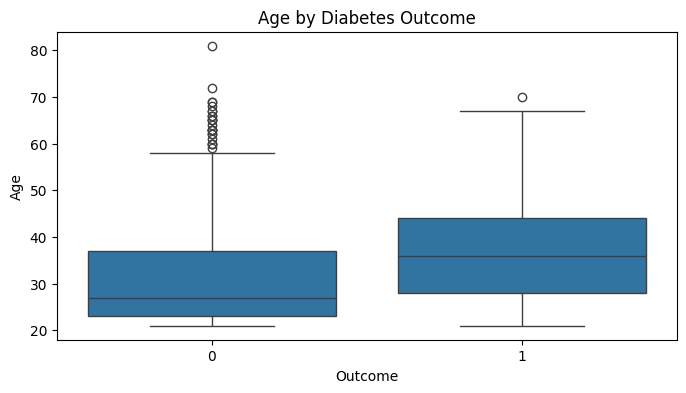
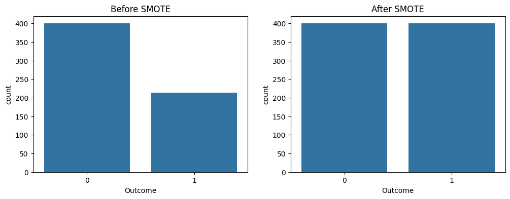
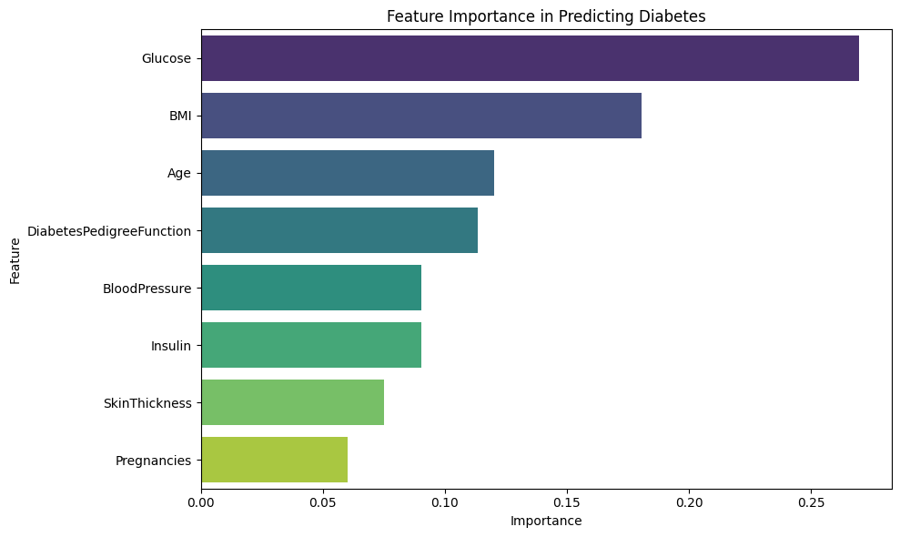
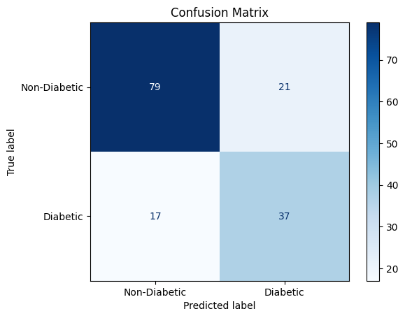
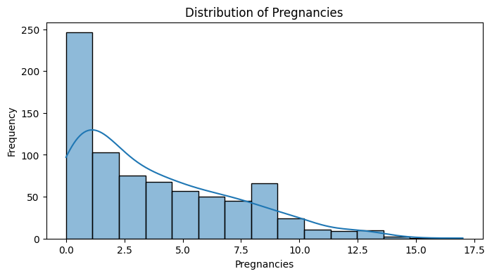
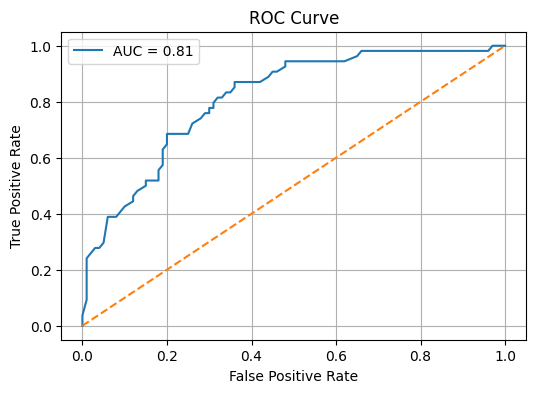

# 🧠 Diabetes Prediction Using Machine Learning

This project uses the Pima Indians Diabetes Dataset to build a predictive model that determines whether a patient is likely to have diabetes. It includes data exploration, preprocessing, class balancing, model training, and evaluation — all done in Google Colab using Python.

---

## 🔍 Project Overview

- Predicts diabetes based on diagnostic health data
- Conducted exploratory data analysis (EDA)
- Balanced imbalanced classes with undersampling
- Trained and evaluated multiple machine learning models
- Visualized performance using confusion matrix and classification report

  

---

## 🛠️ Tech Stack

- **Python**
  - Pandas, NumPy, Matplotlib, Seaborn
  - Scikit-learn (Random Forest, Logistic Regression)
- **Google Colab**
- **Machine Learning**
  - Classification (Binary)
  - Evaluation Metrics: Accuracy, F1 Score, Precision, Recall

---

## 📊 Dataset

- **Source:** [Pima Indians Diabetes Dataset](https://www.kaggle.com/datasets/uciml/pima-indians-diabetes-database)
- **Size:** 768 rows × 9 columns
- **Features:** Pregnancies, Glucose, Blood Pressure, Skin Thickness, Insulin, BMI, Diabetes Pedigree Function, Age
- **Target:** Outcome (1 = Diabetes, 0 = No Diabetes)

---

## ✅ Results

- **Model:** Random Forest Classifier
- **Accuracy:** ~75%
- **Key Features:** Glucose, BMI, Age
- **Evaluation:** Balanced F1-score with clean confusion matrix

---

## 🚀 Next Steps

- Experiment with advanced models (e.g., XGBoost, SVM)
- Implement cross-validation and hyperparameter tuning
- Deploy as a web app using Streamlit or Flask

---

## 📈 Visualizations

### 1. Age Distribution by Diabetes Outcome

- This boxplot highlights age distribution across diabetes outcomes. Individuals diagnosed with diabetes tend to be older on average.

### 2. Class Distribution Before and After SMOTE

- SMOTE was applied to address class imbalance. After SMOTE, the dataset has equal representation of diabetic and non-diabetic cases, which helps improve model performance.

### 3. Feature Importance in Diabetes Prediction

- Glucose level was the most important feature in predicting diabetes, followed by BMI and Age.

  ### 4. Confusion Matrix

- This confusion matrix visually summarizes the performance of a classification model by showing the counts of correct and incorrect predictions for "Non-Diabetic" and "Diabetic" cases.

  ### 5. Diabetes & Pregnancy

- This histogram visually represents the frequency distribution of the 'Pregnancies' variable, indicating how many times each number of pregnancies occurs in the dataset.

  ### 6. ROC Curve

- This ROC Curve, with an AUC of 0.81, demonstrates the model's strong ability to correctly classify individuals as diabetic or non-diabetic within the project's dataset.

---

## 📌 Author

**Ryanne Milligan**  
Aspiring Health Informatics & Cybersecurity Professional  
_Passionate about using AI to improve patient care and health outcomes_

---

## 🤝 Let's Connect

Feel free to reach out or collaborate on LinkedIn or GitHub if you're working on healthcare, AI, or informatics projects!

[LinkedIn – Ryanne Milligan](https://www.linkedin.com/in/ryannemilligan/)

